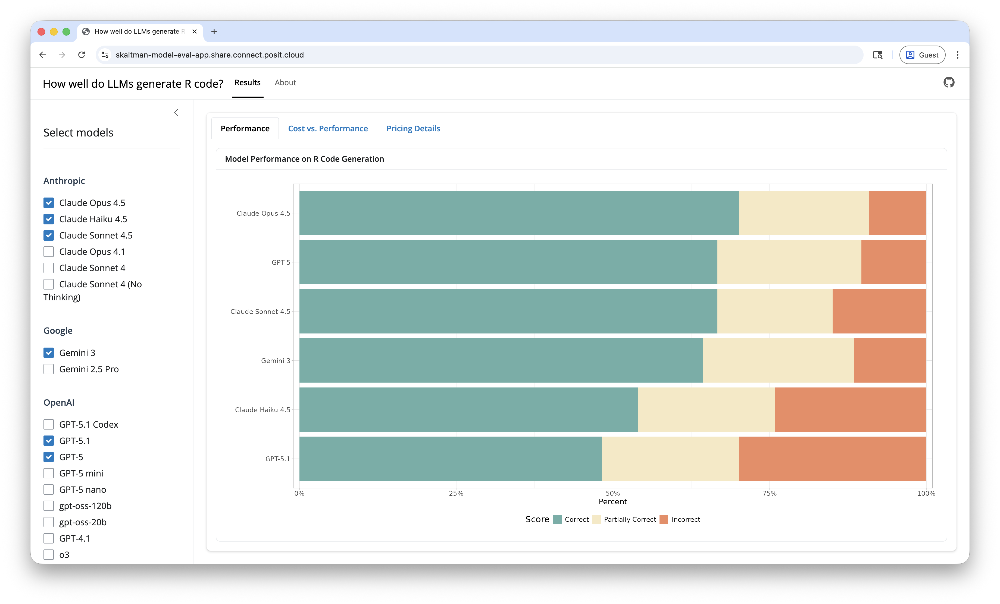

# Which LLM writes the best R code?

This repository evaluates how well different AI models generate R code. The evaluation uses the `are` (**A**n **R** **E**val) dataset from the [vitals package](https://vitals.tidyverse.org/), which contains challenging R coding problems and solutions.

## Shiny App

**[View the live app](https://skaltman-model-eval-app.share.connect.posit.cloud)** to compare model performance and costs for a variety of models. 

## Blog posts

There are also a series of accompanying blog posts which go into more depth about the analysis. Read the latest one: [Which AI model writes the best R code?](https://posit.co/blog/r-llm-evaluation-02/).

## Methodology

* We used [ellmer](https://ellmer.tidyverse.org/) to create connections to the various models and [vitals](https://vitals.tidyverse.org/) to evaluate model performance on R code generation tasks.
* We tested each model on a shared benchmark: the `are` dataset ("**A**n **R** **E**val"). `are` contains a collection of difficult R coding problems and a column, `target`, with information about the target solution.  
* Using vitals, we had each model solve each problem in `are`. Then, we scored their solutions using a scoring model (Claude 3.7 Sonnet). Each solution received either an Incorrect, Partially Correct, or Correct score.

## Running Evaluations

To run the evaluations yourself (or experiment with different models):

1. If adding a new model: edit [`data/models.yaml`](https://github.com/skaltman/model-eval/blob/main/data/models.yaml) with the specification for the model you want to run. 
2. Run [`eval/run_eval.R`](https://github.com/skaltman/model-eval/blob/main/eval/run_eval.R). This will run the evaluation for all models listed in `data/models.yaml`. Note that you will need API keys for all model providers. See the ellmer [documentation on authentication](https://ellmer.tidyverse.org/#authentication) for more details.

### Python/Pandas Evaluations

We also evaluated Pandas code generation using the `inspect_ai` framework. See the [Python version of the blog post](https://posit.co/blog/python-llm-evaluation/) for results.

## Related Work

This work builds on Simon Couch's [blog series](https://www.simonpcouch.com/blog/) analyzing LLM code generation capabilities, including [Claude 4 and R Coding](https://www.simonpcouch.com/blog/2025-05-27-claude-4/).

